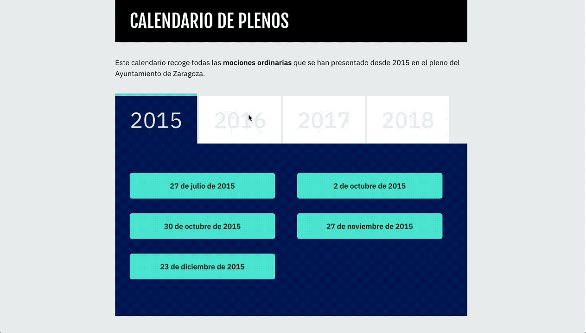
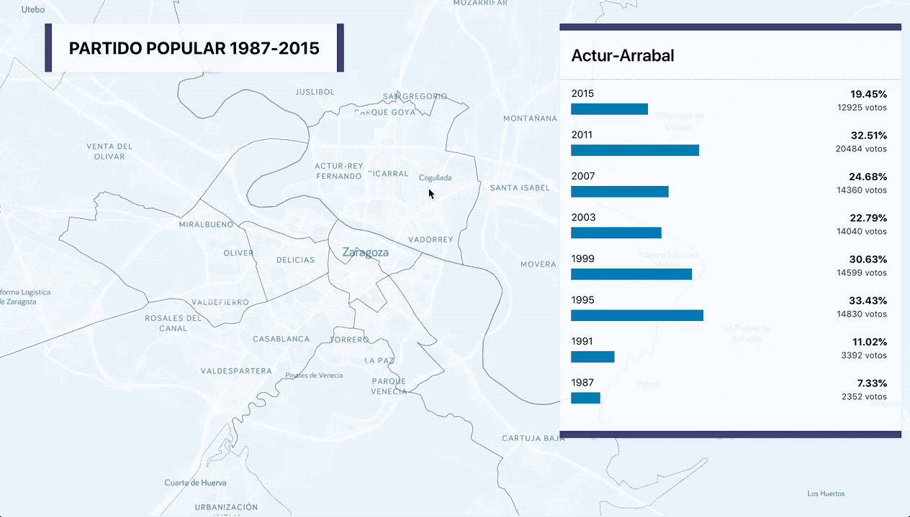

# Bislai

Mostramos de una manera más accesible las propuestas y acuerdos que toman los partidos políticos en el Ayuntamiento de Zaragoza.

# Que vas a encontrar en Bislai

- Buscador en todas las mociones presentadas en la última legislatura del Ayuntamiento de Zaragoza
- Calendario de plenos celebrados
- Gráficas individuales para cada votación
- Estadísticas generales
- Estadísticas de cada partido con representación en el Ayuntamiento de Zaragoza
- Gráficas y mapas con los resultados por distrito electoral desde 1987

## Buscador de plenos

Busca en todos los plenos por cualquier palabra: ¿agua? ¿bus? ¿bicicleta?

[Buscador](http://bislai.co/buscador)

## Calendario de plenos

## Gráficas para cada pleno

El resultado de cada una de las votaciones contiene un gráfica personalizada

## Estadísticas

Recopilamos todas las votaciones y generamos diferentes estadísticas con ellas: tripartitos, ¿quién vota a favor?, ¿quién vota en contra?

[estadísticas generales](http://bislai.co/estadisticas)    
[estadísticas por partidos](http://bislai.co/partidos)

## Gráficas y mapas por distrito electoral

Un mapa que muestra los resultados de cada partido por distrito electoral desde 1987 hasta 2015

Una gráfica por distrito que muestra los resultados desde 1987 hasta 2015

## Autores

[Jorge Aznar](https://github.com/jorgeatgu)

## Licencia

Este proyecto está bajo una [licencia](LICENSE.md) de Creative Commons Reconocimiento-CompartirIgual 4.0 Internacional.

